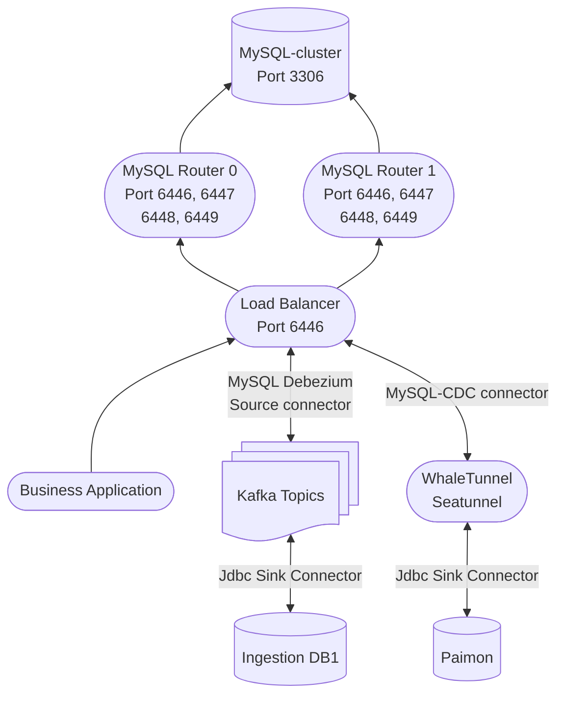

https://diptochakrabarty.medium.com/setting-mysql-cluster-using-docker-f0e405d03762

https://github.com/DiptoChakrabarty/mysql-docker-cluster


## Bootstraping MySQL Router

### Environment setup


</br></br>


## Starting up the MySQL cluster

### Start up MySQL Cluster Nodes docker containers

```shell
make up ct=mysql-a
make up ct=mysql-b
make up ct=mysql-c
or
docker compose up -d
```
```initdb.d/setup.sql``` created clusteradmin

### Configure each container
- Login the first node with ```mysqlsh```
```sql
docker compose exec mysql-a mysqlsh -uclusteradmin -pcladmin -hlocalhost

Switching to JavaScript mode...
 MySQL  localhost  JS > 
```

- Check each node if it is suitable for acting as a cluster node
```js
dba.checkInstanceConfiguration("clusteradmin:cladmin@mysql-a:3306")
```

- Configure each node , this too for all three nodes
```js
dba.configureInstance("clusteradmin:cladmin@mysql-a:3306")
dba.configureInstance("clusteradmin:cladmin@mysql-b:3306")
dba.configureInstance("clusteradmin:cladmin@mysql-c:3306")
```
### Setting up the cluster
```
var cluster = dba.createCluster("Cluster_Lab")

cluster.status()
```
- In the first cluster node, add new member instance to cluster
-  each cluster node will need to restart once.
```
cluster.addInstance("clusteradmin:cladmin@mysql-b:3306")

cluster.addInstance("clusteradmin:cladmin@mysql-c:3306")
```

-  After database cloned to new cluster member, then requires to restarted new member manually
-  Repeat add instance steps for all slave member nodes
```js
Please select a recovery method [C]lone/[I]ncremental recovery/[A]bort (default Clone): C
Validating instance configuration at mysql-b:3306...

Instance configuration is suitable.
NOTE: Group Replication will communicate with other members using 'mysql-b:3306'. Use the localAddress option to override.

* Checking connectivity and SSL configuration...

A new instance will be added to the InnoDB Cluster. Depending on the amount of
data on the cluster this might take from a few seconds to several hours.

Adding instance to the cluster...

Monitoring recovery process of the new cluster member. Press ^C to stop monitoring and let it continue in background.
Clone based state recovery is now in progress.

NOTE: A server restart is expected to happen as part of the clone process. If the
server does not support the RESTART command or does not come back after a
while, you may need to manually start it back.

* Waiting for clone to finish...
NOTE: mysql-b:3306 is being cloned from mysql-a:3306
** Stage DROP DATA: Completed
** Clone Transfer
    FILE COPY  ############################################################  100%  Completed
    PAGE COPY  ############################################################  100%  Completed
    REDO COPY  ############################################################  100%  Completed

NOTE: mysql-b:3306 is shutting down...

* Waiting for server restart... ready
* mysql-b:3306 has restarted, waiting for clone to finish...
** Stage RESTART: Completed
* Clone process has finished: 79.97 MB transferred in about 1 second (~79.97 MB/s)

State recovery already finished for 'mysql-b:3306'

The instance 'mysql-b:3306' was successfully added to the cluster.
```


###  Show cluster status while login
```
var cluster=dba.getCluster()

cluster.status()
```
### Restoring the Cluster from complete outage...
- if cluster var is not set
- Reform cluster after restart
```
var cluster = dba.rebootClusterFromCompleteOutage();

cluster.status()

```
- Cluster restore log
```
MySQL  mysql-a:3306 ssl  JS > var cluster = dba.rebootClusterFromCompleteOutage();
Restoring the Cluster 'Cluster_Lab' from complete outage...

Cluster instances: 'mysql-a:3306' (OFFLINE), 'mysql-b:3306' (OFFLINE), 'mysql-c:3306' (OFFLINE)
Waiting for instances to apply pending received transactions...
Validating instance configuration at mysql-a...

This instance reports its own address as mysql-a:3306

Instance configuration is suitable.
NOTE: User 'mysql_innodb_cluster_1'@'%' already existed at instance 'mysql-a:3306'. It will be deleted and created again with a new password.
* Waiting for seed instance to become ONLINE...
mysql-a:3306 was restored.
Updating instance metadata...
The instance metadata for 'mysql-a:3306' was successfully updated.
...
...

Instance configuration is suitable.
Rejoining instance 'mysql-c:3306' to cluster 'Cluster_Lab'...

Re-creating recovery account...
NOTE: User 'mysql_innodb_cluster_3'@'%' already existed at instance 'mysql-a:3306'. It will be deleted and created again with a new password.
Monitoring recovery process of the new cluster member. Press ^C to stop monitoring and let it continue in background.
State recovery already finished for 'mysql-c:3306'

The instance 'mysql-c:3306' was successfully rejoined to the cluster.

The Cluster was successfully rebooted.

```

### Starting MySQL router container
```shell
make router0.run

make router1.run
```

### MySQL router logs sample
```shell
docker run \
        -e MYSQL_HOST=10.1.1.105 \
        -e MYSQL_PORT=3306 \
        -e MYSQL_USER=root \
        -e MYSQL_PASSWORD=Abcd1234 \
        -e MYSQL_INNODB_CLUSTER_MEMBERS=3 \
        --network cluster_default \
        -p 6446:6446 \
        -p 6447:6447 \
        -p 6448:6448 \
        -p 6449:6449 \
        -p 6450:6450 \
        -v /docker/mysql-lab/deploy/router/resource/:/resource/ \
        -ti container-registry.oracle.com/mysql/community-router:8.4.1
[Entrypoint] MYSQL_CREATE_ROUTER_USER is not set, Router will generate a new account to be used at runtime.
[Entrypoint] Set it to 0 to reuse root instead.
[Entrypoint] Succesfully contacted mysql server at 10.1.1.105:3306. Checking for cluster state.
0
12
[Entrypoint] Successfully contacted cluster with 3 members. Bootstrapping.
[Entrypoint] Succesfully contacted mysql server at 10.1.1.105. Trying to bootstrap.
Please enter MySQL password for root:
# Bootstrapping MySQL Router 8.4.1 (MySQL Community - GPL) instance at '/tmp/mysqlrouter'...

Fetching Cluster Members
trying to connect to mysql-server at mysql-b:3306
- Creating account(s) (only those that are needed, if any)
- Verifying account (using it to run SQL queries that would be run by Router)
- Storing account in keyring
- Adjusting permissions of generated files
- Creating configuration /tmp/mysqlrouter/mysqlrouter.conf

# MySQL Router configured for the InnoDB Cluster 'Cluster_Lab'

After this MySQL Router has been started with the generated configuration

    $ mysqlrouter -c /tmp/mysqlrouter/mysqlrouter.conf

InnoDB Cluster 'Cluster_Lab' can be reached by connecting to:

## MySQL Classic protocol

- Read/Write Connections: localhost:6446
- Read/Only Connections:  localhost:6447
- Read/Write Split Connections: localhost:6450

## MySQL X protocol

- Read/Write Connections: localhost:6448
- Read/Only Connections:  localhost:6449

[Entrypoint] Starting mysql-router.
2025-06-05 02:26:08 main SYSTEM [7af3b1fd53c0] Starting 'MySQL Router', version: 8.4.1 (MySQL Community - GPL)
2025-06-05 02:26:08 io INFO [7af3b1fd53c0] starting 20 io-threads, using backend 'linux_epoll'
2025-06-05 02:26:08 http_server INFO [7af3b1fd53c0] listening on 0.0.0.0:8443
2025-06-05 02:26:08 metadata_cache_plugin INFO [7af3a1766640] Starting Metadata Cache
2025-06-05 02:26:08 metadata_cache INFO [7af3a1766640] Connections using ssl_mode 'PREFERRED'
2025-06-05 02:26:08 routing_plugin INFO [7af38a7fc640] [routing:bootstrap_ro] 'router_require_enforce=1', but neither 'client_ssl_ca' nor 'client_ssl_cadir' are set. MySQL account with ATTRIBUTE '{ "router_require": { "x509": true } }' will fail to auth.
2025-06-05 02:26:08 metadata_cache INFO [7af3a0764640] Starting metadata cache refresh thread
2025-06-05 02:26:08 routing_plugin INFO [7af3897fa640] [routing:bootstrap_rw_split] 'router_require_enforce=1', but neither 'client_ssl_ca' nor 'client_ssl_cadir' are set. MySQL account with ATTRIBUTE '{ "router_require": { "x509": true } }' will fail to auth.
2025-06-05 02:26:08 routing_plugin INFO [7af389ffb640] [routing:bootstrap_rw] 'router_require_enforce=1', but neither 'client_ssl_ca' nor 'client_ssl_cadir' are set. MySQL account with ATTRIBUTE '{ "router_require": { "x509": true } }' will fail to auth.
2025-06-05 02:26:08 routing INFO [7af38a7fc640] [routing:bootstrap_ro] started: routing strategy = round-robin-with-fallback
2025-06-05 02:26:08 routing INFO [7af38a7fc640] Start accepting connections for routing routing:bootstrap_ro listening on '0.0.0.0:6447'
2025-06-05 02:26:08 routing INFO [7af388ff9640] [routing:bootstrap_x_ro] started: routing strategy = round-robin-with-fallback
2025-06-05 02:26:08 routing INFO [7af388ff9640] Start accepting connections for routing routing:bootstrap_x_ro listening on '0.0.0.0:6449'
2025-06-05 02:26:08 routing INFO [7af36bfff640] [routing:bootstrap_x_rw] started: routing strategy = first-available
2025-06-05 02:26:08 routing INFO [7af36bfff640] Start accepting connections for routing routing:bootstrap_x_rw listening on '0.0.0.0:6448'
2025-06-05 02:26:08 routing INFO [7af3897fa640] [routing:bootstrap_rw_split] started: routing strategy = round-robin
2025-06-05 02:26:08 routing INFO [7af3897fa640] Start accepting connections for routing routing:bootstrap_rw_split listening on '0.0.0.0:6450'
2025-06-05 02:26:08 routing INFO [7af389ffb640] [routing:bootstrap_rw] started: routing strategy = first-available
2025-06-05 02:26:08 routing INFO [7af389ffb640] Start accepting connections for routing routing:bootstrap_rw listening on '0.0.0.0:6446'
2025-06-05 02:26:08 metadata_cache INFO [7af3a0764640] Connected with metadata server running on mysql-a:3306
2025-06-05 02:26:08 metadata_cache INFO [7af3a0764640] New router options read from the metadata '{"tags": {}, "Configuration": {"8.4.1": {"Defaults": {"io": {"threads": 0}, "common": {"name": "system", "socket": "", "bind_address": "0.0.0.0", "read_timeout": 30, "server_ssl_ca": "", "server_ssl_crl": "", "client_ssl_mode": "PREFERRED", "connect_timeout": 5, "max_connections": 0, "server_ssl_mode": "PREFERRED", "client_ssl_cipher": "", "client_ssl_curves": "", "net_buffer_length": 16384, "server_ssl_capath": "", "server_ssl_cipher": "", "server_ssl_curves": "", "server_ssl_verify": "DISABLED", "thread_stack_size": 1024, "connection_sharing": false, "max_connect_errors": 100, "server_ssl_crlpath": "", "wait_for_my_writes": true, "client_ssl_dh_params": "", "max_total_connections": 512, "unknown_config_option": "error", "client_connect_timeout": 9, "connection_sharing_delay": 1.0, "wait_for_my_writes_timeout": 2, "max_idle_server_connections": 64}, "loggers": {"filelog": {"level": "info", "filename": "mysqlrouter.log", "destination": "", "timestamp_precision": "second"}}, "endpoints": {"bootstrap_ro": {"socket": "", "protocol": "classic", "bind_port": 6447, "bind_address": "0.0.0.0", "destinations": "metadata-cache://Cluster_Lab/?role=SECONDARY", "server_ssl_ca": "", "server_ssl_crl": "", "client_ssl_mode": "PREFERRED", "connect_timeout": 5, "max_connections": 0, "server_ssl_mode": "PREFERRED", "routing_strategy": "round-robin-with-fallback", "client_ssl_cipher": "", "client_ssl_curves": "", "net_buffer_length": 16384, "server_ssl_capath": "", "server_ssl_cipher": "", "server_ssl_curves": "", "server_ssl_verify": "DISABLED", "thread_stack_size": 1024, "connection_sharing": false, "max_connect_errors": 100, "server_ssl_crlpath": "", "wait_for_my_writes": true, "client_ssl_dh_params": "", "client_connect_timeout": 9, "router_require_enforce": true, "connection_sharing_delay": 1.0, "wait_for_my_writes_timeout": 2}, "bootstrap_rw": {"socket": "", "protocol": "classic", "bind_port": 6446, "bind_address": "0.0.0.0", "destinations": "metadata-cache://Cluster_Lab/?role=PRIMARY", "server_ssl_ca": "", "server_ssl_crl": "", "client_ssl_mode": "PREFERRED", "connect_timeout": 5, "max_connections": 0, "server_ssl_mode": "PREFERRED", "routing_strategy": "first-available", "client_ssl_cipher": "", "client_ssl_curves": "", "net_buffer_length": 16384, "server_ssl_capath": "", "server_ssl_cipher": "", "server_ssl_curves": "", "server_ssl_verify": "DISABLED", "thread_stack_size": 1024, "connection_sharing": false, "max_connect_errors": 100, "server_ssl_crlpath": "", "wait_for_my_writes": true, "client_ssl_dh_params": "", "client_connect_timeout": 9, "router_require_enforce": true, "connection_sharing_delay": 1.0, "wait_for_my_writes_timeout": 2}, "bootstrap_x_ro": {"socket": "", "protocol": "x", "bind_port": 6449, "bind_address": "0.0.0.0", "destinations": "metadata-cache://Cluster_Lab/?role=SECONDARY", "server_ssl_ca": "", "server_ssl_crl": "", "client_ssl_mode": "PREFERRED", "connect_timeout": 5, "max_connections": 0, "server_ssl_mode": "PREFERRED", "routing_strategy": "round-robin-with-fallback", "client_ssl_cipher": "", "client_ssl_curves": "", "net_buffer_length": 16384, "server_ssl_capath": "", "server_ssl_cipher": "", "server_ssl_curves": "", "server_ssl_verify": "DISABLED", "thread_stack_size": 1024, "connection_sharing": false, "max_connect_errors": 100, "server_ssl_crlpath": "", "wait_for_my_writes": true, "client_ssl_dh_params": "", "client_connect_timeout": 9, "router_require_enforce": false, "connection_sharing_delay": 1.0, "wait_for_my_writes_timeout": 2}, "bootstrap_x_rw": {"socket": "", "protocol": "x", "bind_port": 6448, "bind_address": "0.0.0.0", "destinations": "metadata-cache://Cluster_Lab/?role=PRIMARY", "server_ssl_ca": "", "server_ssl_crl": "", "client_ssl_mode": "PREFERRED", "connect_timeout": 5, "max_connections": 0, "server_ssl_mode": "PREFERRED", "routing_strategy": "first-available", "client_ssl_cipher": "", "client_ssl_curves": "", "net_buffer_length": 16384, "server_ssl_capath": "", "server_ssl_cipher": "", "server_ssl_curves": "", "server_ssl_verify": "DISABLED", "
2025-06-05 02:26:08 metadata_cache INFO [7af3a0764640] Using unreachable_quorum_allowed_traffic='none'
2025-06-05 02:26:08 metadata_cache INFO [7af3a0764640] Using read_only_targets='secondaries'
2025-06-05 02:26:08 metadata_cache INFO [7af3a0764640] Potential changes detected in cluster after metadata refresh (view_id=0)
2025-06-05 02:26:08 metadata_cache INFO [7af3a0764640] Metadata for cluster 'Cluster_Lab' has 3 member(s), single-primary:
2025-06-05 02:26:08 metadata_cache INFO [7af3a0764640]     mysql-a:3306 / 33060 - mode=RO
2025-06-05 02:26:08 metadata_cache INFO [7af3a0764640]     mysql-b:3306 / 33060 - mode=RW
2025-06-05 02:26:08 metadata_cache INFO [7af3a0764640]     mysql-c:3306 / 33060 - mode=RO
2025-06-05 02:26:08 metadata_cache INFO [7af3a0764640] Connected with metadata server running on mysql-b:3306

```