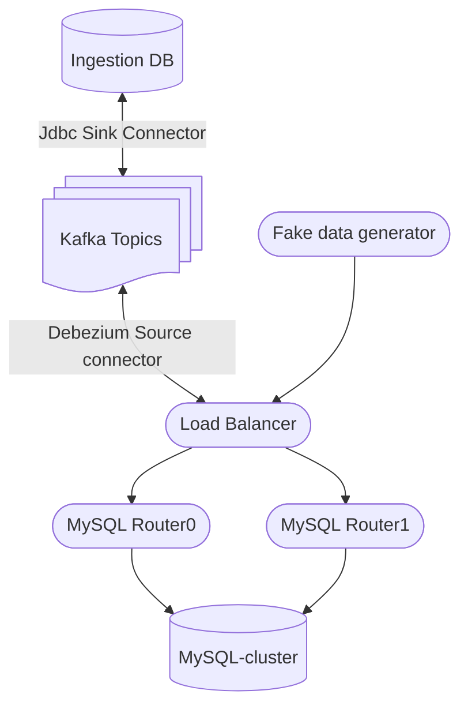

## Bootstraping MySQL Router

### Environment setup


</br></br>

Starting MySQL router container
```shell

docker run \
        -e MYSQL_HOST=10.1.1.105 \
        -e MYSQL_PORT=3306 \
        -e MYSQL_USER=root \
        -e MYSQL_PASSWORD=Abcd1234 \
        -e MYSQL_INNODB_CLUSTER_MEMBERS=3 \
        --network cluster_default \
        -p 6446:6446 \
        -p 6447:6447 \
        -p 6448:6448 \
        -p 6449:6449 \
        -p 6450:6450 \
        -v /docker/mysql-lab/deploy/router/resource/:/resource/ \
        -ti container-registry.oracle.com/mysql/community-router:8.4.1
[Entrypoint] MYSQL_CREATE_ROUTER_USER is not set, Router will generate a new account to be used at runtime.
[Entrypoint] Set it to 0 to reuse root instead.
[Entrypoint] Succesfully contacted mysql server at 10.1.1.105:3306. Checking for cluster state.
0
12
[Entrypoint] Successfully contacted cluster with 3 members. Bootstrapping.
[Entrypoint] Succesfully contacted mysql server at 10.1.1.105. Trying to bootstrap.
Please enter MySQL password for root:
# Bootstrapping MySQL Router 8.4.1 (MySQL Community - GPL) instance at '/tmp/mysqlrouter'...

Fetching Cluster Members
trying to connect to mysql-server at mysql-b:3306
- Creating account(s) (only those that are needed, if any)
- Verifying account (using it to run SQL queries that would be run by Router)
- Storing account in keyring
- Adjusting permissions of generated files
- Creating configuration /tmp/mysqlrouter/mysqlrouter.conf

# MySQL Router configured for the InnoDB Cluster 'Cluster_Lab'

After this MySQL Router has been started with the generated configuration

    $ mysqlrouter -c /tmp/mysqlrouter/mysqlrouter.conf

InnoDB Cluster 'Cluster_Lab' can be reached by connecting to:

## MySQL Classic protocol

- Read/Write Connections: localhost:6446
- Read/Only Connections:  localhost:6447
- Read/Write Split Connections: localhost:6450

## MySQL X protocol

- Read/Write Connections: localhost:6448
- Read/Only Connections:  localhost:6449

[Entrypoint] Starting mysql-router.
2025-06-05 02:26:08 main SYSTEM [7af3b1fd53c0] Starting 'MySQL Router', version: 8.4.1 (MySQL Community - GPL)
2025-06-05 02:26:08 io INFO [7af3b1fd53c0] starting 20 io-threads, using backend 'linux_epoll'
2025-06-05 02:26:08 http_server INFO [7af3b1fd53c0] listening on 0.0.0.0:8443
2025-06-05 02:26:08 metadata_cache_plugin INFO [7af3a1766640] Starting Metadata Cache
2025-06-05 02:26:08 metadata_cache INFO [7af3a1766640] Connections using ssl_mode 'PREFERRED'
2025-06-05 02:26:08 routing_plugin INFO [7af38a7fc640] [routing:bootstrap_ro] 'router_require_enforce=1', but neither 'client_ssl_ca' nor 'client_ssl_cadir' are set. MySQL account with ATTRIBUTE '{ "router_require": { "x509": true } }' will fail to auth.
2025-06-05 02:26:08 metadata_cache INFO [7af3a0764640] Starting metadata cache refresh thread
2025-06-05 02:26:08 routing_plugin INFO [7af3897fa640] [routing:bootstrap_rw_split] 'router_require_enforce=1', but neither 'client_ssl_ca' nor 'client_ssl_cadir' are set. MySQL account with ATTRIBUTE '{ "router_require": { "x509": true } }' will fail to auth.
2025-06-05 02:26:08 routing_plugin INFO [7af389ffb640] [routing:bootstrap_rw] 'router_require_enforce=1', but neither 'client_ssl_ca' nor 'client_ssl_cadir' are set. MySQL account with ATTRIBUTE '{ "router_require": { "x509": true } }' will fail to auth.
2025-06-05 02:26:08 routing INFO [7af38a7fc640] [routing:bootstrap_ro] started: routing strategy = round-robin-with-fallback
2025-06-05 02:26:08 routing INFO [7af38a7fc640] Start accepting connections for routing routing:bootstrap_ro listening on '0.0.0.0:6447'
2025-06-05 02:26:08 routing INFO [7af388ff9640] [routing:bootstrap_x_ro] started: routing strategy = round-robin-with-fallback
2025-06-05 02:26:08 routing INFO [7af388ff9640] Start accepting connections for routing routing:bootstrap_x_ro listening on '0.0.0.0:6449'
2025-06-05 02:26:08 routing INFO [7af36bfff640] [routing:bootstrap_x_rw] started: routing strategy = first-available
2025-06-05 02:26:08 routing INFO [7af36bfff640] Start accepting connections for routing routing:bootstrap_x_rw listening on '0.0.0.0:6448'
2025-06-05 02:26:08 routing INFO [7af3897fa640] [routing:bootstrap_rw_split] started: routing strategy = round-robin
2025-06-05 02:26:08 routing INFO [7af3897fa640] Start accepting connections for routing routing:bootstrap_rw_split listening on '0.0.0.0:6450'
2025-06-05 02:26:08 routing INFO [7af389ffb640] [routing:bootstrap_rw] started: routing strategy = first-available
2025-06-05 02:26:08 routing INFO [7af389ffb640] Start accepting connections for routing routing:bootstrap_rw listening on '0.0.0.0:6446'
2025-06-05 02:26:08 metadata_cache INFO [7af3a0764640] Connected with metadata server running on mysql-a:3306
2025-06-05 02:26:08 metadata_cache INFO [7af3a0764640] New router options read from the metadata '{"tags": {}, "Configuration": {"8.4.1": {"Defaults": {"io": {"threads": 0}, "common": {"name": "system", "socket": "", "bind_address": "0.0.0.0", "read_timeout": 30, "server_ssl_ca": "", "server_ssl_crl": "", "client_ssl_mode": "PREFERRED", "connect_timeout": 5, "max_connections": 0, "server_ssl_mode": "PREFERRED", "client_ssl_cipher": "", "client_ssl_curves": "", "net_buffer_length": 16384, "server_ssl_capath": "", "server_ssl_cipher": "", "server_ssl_curves": "", "server_ssl_verify": "DISABLED", "thread_stack_size": 1024, "connection_sharing": false, "max_connect_errors": 100, "server_ssl_crlpath": "", "wait_for_my_writes": true, "client_ssl_dh_params": "", "max_total_connections": 512, "unknown_config_option": "error", "client_connect_timeout": 9, "connection_sharing_delay": 1.0, "wait_for_my_writes_timeout": 2, "max_idle_server_connections": 64}, "loggers": {"filelog": {"level": "info", "filename": "mysqlrouter.log", "destination": "", "timestamp_precision": "second"}}, "endpoints": {"bootstrap_ro": {"socket": "", "protocol": "classic", "bind_port": 6447, "bind_address": "0.0.0.0", "destinations": "metadata-cache://Cluster_Lab/?role=SECONDARY", "server_ssl_ca": "", "server_ssl_crl": "", "client_ssl_mode": "PREFERRED", "connect_timeout": 5, "max_connections": 0, "server_ssl_mode": "PREFERRED", "routing_strategy": "round-robin-with-fallback", "client_ssl_cipher": "", "client_ssl_curves": "", "net_buffer_length": 16384, "server_ssl_capath": "", "server_ssl_cipher": "", "server_ssl_curves": "", "server_ssl_verify": "DISABLED", "thread_stack_size": 1024, "connection_sharing": false, "max_connect_errors": 100, "server_ssl_crlpath": "", "wait_for_my_writes": true, "client_ssl_dh_params": "", "client_connect_timeout": 9, "router_require_enforce": true, "connection_sharing_delay": 1.0, "wait_for_my_writes_timeout": 2}, "bootstrap_rw": {"socket": "", "protocol": "classic", "bind_port": 6446, "bind_address": "0.0.0.0", "destinations": "metadata-cache://Cluster_Lab/?role=PRIMARY", "server_ssl_ca": "", "server_ssl_crl": "", "client_ssl_mode": "PREFERRED", "connect_timeout": 5, "max_connections": 0, "server_ssl_mode": "PREFERRED", "routing_strategy": "first-available", "client_ssl_cipher": "", "client_ssl_curves": "", "net_buffer_length": 16384, "server_ssl_capath": "", "server_ssl_cipher": "", "server_ssl_curves": "", "server_ssl_verify": "DISABLED", "thread_stack_size": 1024, "connection_sharing": false, "max_connect_errors": 100, "server_ssl_crlpath": "", "wait_for_my_writes": true, "client_ssl_dh_params": "", "client_connect_timeout": 9, "router_require_enforce": true, "connection_sharing_delay": 1.0, "wait_for_my_writes_timeout": 2}, "bootstrap_x_ro": {"socket": "", "protocol": "x", "bind_port": 6449, "bind_address": "0.0.0.0", "destinations": "metadata-cache://Cluster_Lab/?role=SECONDARY", "server_ssl_ca": "", "server_ssl_crl": "", "client_ssl_mode": "PREFERRED", "connect_timeout": 5, "max_connections": 0, "server_ssl_mode": "PREFERRED", "routing_strategy": "round-robin-with-fallback", "client_ssl_cipher": "", "client_ssl_curves": "", "net_buffer_length": 16384, "server_ssl_capath": "", "server_ssl_cipher": "", "server_ssl_curves": "", "server_ssl_verify": "DISABLED", "thread_stack_size": 1024, "connection_sharing": false, "max_connect_errors": 100, "server_ssl_crlpath": "", "wait_for_my_writes": true, "client_ssl_dh_params": "", "client_connect_timeout": 9, "router_require_enforce": false, "connection_sharing_delay": 1.0, "wait_for_my_writes_timeout": 2}, "bootstrap_x_rw": {"socket": "", "protocol": "x", "bind_port": 6448, "bind_address": "0.0.0.0", "destinations": "metadata-cache://Cluster_Lab/?role=PRIMARY", "server_ssl_ca": "", "server_ssl_crl": "", "client_ssl_mode": "PREFERRED", "connect_timeout": 5, "max_connections": 0, "server_ssl_mode": "PREFERRED", "routing_strategy": "first-available", "client_ssl_cipher": "", "client_ssl_curves": "", "net_buffer_length": 16384, "server_ssl_capath": "", "server_ssl_cipher": "", "server_ssl_curves": "", "server_ssl_verify": "DISABLED", "
2025-06-05 02:26:08 metadata_cache INFO [7af3a0764640] Using unreachable_quorum_allowed_traffic='none'
2025-06-05 02:26:08 metadata_cache INFO [7af3a0764640] Using read_only_targets='secondaries'
2025-06-05 02:26:08 metadata_cache INFO [7af3a0764640] Potential changes detected in cluster after metadata refresh (view_id=0)
2025-06-05 02:26:08 metadata_cache INFO [7af3a0764640] Metadata for cluster 'Cluster_Lab' has 3 member(s), single-primary:
2025-06-05 02:26:08 metadata_cache INFO [7af3a0764640]     mysql-a:3306 / 33060 - mode=RO
2025-06-05 02:26:08 metadata_cache INFO [7af3a0764640]     mysql-b:3306 / 33060 - mode=RW
2025-06-05 02:26:08 metadata_cache INFO [7af3a0764640]     mysql-c:3306 / 33060 - mode=RO
2025-06-05 02:26:08 metadata_cache INFO [7af3a0764640] Connected with metadata server running on mysql-b:3306

```


run the bash with MySQL Router image; make sure the container and MySQL cluster in the **same network**
```shell
docker run \
-e MYSQL_HOST=10.1.1.105 \
-e MYSQL_PORT=3306 \
-e MYSQL_USER=router \
-e MYSQL_PASSWORD=Abcd1234 \
-e MYSQL_INNODB_CLUSTER_MEMBERS=3 \
--network cluster_default \
-ti container-registry.oracle.com/mysql/community-router:8.4.1 /bin/bash
```

```shell
bash-5.1$ mysqlrouter --bootstrap root@10.1.1.105:3306 --directory /tmp/myrouter --conf-use-sockets --account router01 --account-create always
Please enter MySQL password for root:
# Bootstrapping MySQL Router 8.4.1 (MySQL Community - GPL) instance at '/tmp/myrouter'...

Please enter MySQL password for router01:
Fetching Cluster Members
trying to connect to mysql-server at mysql-b:3306
- Creating account(s)
- Verifying account (using it to run SQL queries that would be run by Router)
- Storing account in keyring
- Adjusting permissions of generated files
- Creating configuration /tmp/myrouter/mysqlrouter.conf

# MySQL Router configured for the InnoDB Cluster 'Cluster_Lab'

After this MySQL Router has been started with the generated configuration

    $ mysqlrouter -c /tmp/myrouter/mysqlrouter.conf

InnoDB Cluster 'Cluster_Lab' can be reached by connecting to:

## MySQL Classic protocol

- Read/Write Connections: localhost:6446, /tmp/myrouter/mysql.sock
- Read/Only Connections:  localhost:6447, /tmp/myrouter/mysqlro.sock
- Read/Write Split Connections: localhost:6450, /tmp/myrouter/mysqlsplit.sock

## MySQL X protocol

- Read/Write Connections: localhost:6448, /tmp/myrouter/mysqlx.sock
- Read/Only Connections:  localhost:6449, /tmp/myrouter/mysqlxro.sock

```


```js

 var cluster = dba.rebootClusterFromCompleteOutage()
 ```

GRANT GROUP_REPLICATION_STREAM ON *.* TO 'mysql_innodb_cluster_2'@'%'

```conf
cat /tmp/myrouter/mysqlrouter.conf
# File automatically generated during MySQL Router bootstrap
[DEFAULT]
logging_folder=/tmp/myrouter/log
runtime_folder=/tmp/myrouter/run
data_folder=/tmp/myrouter/data
keyring_path=/tmp/myrouter/data/keyring
master_key_path=/tmp/myrouter/mysqlrouter.key
connect_timeout=5
read_timeout=30
dynamic_state=/tmp/myrouter/data/state.json
client_ssl_cert=/tmp/myrouter/data/router-cert.pem
client_ssl_key=/tmp/myrouter/data/router-key.pem
client_ssl_mode=PREFERRED
server_ssl_mode=PREFERRED
server_ssl_verify=DISABLED
unknown_config_option=error
max_idle_server_connections=64
router_require_enforce=1

[logger]
level=info

[metadata_cache:bootstrap]
cluster_type=gr
router_id=2
user=router02
metadata_cluster=Cluster_Lab
ttl=0.5
auth_cache_ttl=-1
auth_cache_refresh_interval=2
use_gr_notifications=0

[routing:bootstrap_rw]
bind_address=0.0.0.0
bind_port=6446
socket=/tmp/myrouter/mysql.sock
destinations=metadata-cache://Cluster_Lab/?role=PRIMARY
routing_strategy=first-available
protocol=classic

[routing:bootstrap_ro]
bind_address=0.0.0.0
bind_port=6447
socket=/tmp/myrouter/mysqlro.sock
destinations=metadata-cache://Cluster_Lab/?role=SECONDARY
routing_strategy=round-robin-with-fallback
protocol=classic

[routing:bootstrap_rw_split]
bind_address=0.0.0.0
bind_port=6450
socket=/tmp/myrouter/mysqlsplit.sock
destinations=metadata-cache://Cluster_Lab/?role=PRIMARY_AND_SECONDARY
routing_strategy=round-robin
protocol=classic
connection_sharing=1
client_ssl_mode=PREFERRED
server_ssl_mode=PREFERRED
access_mode=auto

[routing:bootstrap_x_rw]
bind_address=0.0.0.0
bind_port=6448
socket=/tmp/myrouter/mysqlx.sock
destinations=metadata-cache://Cluster_Lab/?role=PRIMARY
routing_strategy=first-available
protocol=x
router_require_enforce=0
client_ssl_ca=
server_ssl_key=
server_ssl_cert=

[routing:bootstrap_x_ro]
bind_address=0.0.0.0
bind_port=6449
socket=/tmp/myrouter/mysqlxro.sock
destinations=metadata-cache://Cluster_Lab/?role=SECONDARY
routing_strategy=round-robin-with-fallback
protocol=x
router_require_enforce=0
client_ssl_ca=
server_ssl_key=
server_ssl_cert=

[http_server]
port=8443
ssl=1
ssl_cert=/tmp/myrouter/data/router-cert.pem
ssl_key=/tmp/myrouter/data/router-key.pem

[http_auth_realm:default_auth_realm]
backend=default_auth_backend
method=basic
name=default_realm

[rest_router]
require_realm=default_auth_realm

[rest_api]

[http_auth_backend:default_auth_backend]
backend=metadata_cache

[rest_routing]
require_realm=default_auth_realm

[rest_metadata_cache]
require_realm=default_auth_realm

```


## Errors cases

### if all MySQL cluster node shutdown at a time then restarted;
Kafka MySQL CDC connector gets below errors; and cannot be recovery
```

connect-01  | [2025-06-06 07:32:57,014] DEBUG WorkerSourceTask{id=mysql_inventory_CDCSrc01-0} Committing offsets (org.apache.kafka.connect.runtime.WorkerSourceTask)
connect-01  | [2025-06-06 07:32:57,015] DEBUG WorkerSourceTask{id=mysql_inventory_CDCSrc01-0} Either no records were produced by the task since the last offset commit, or every record has been filtered out by a transformation or dropped due to transformation or conversion errors. (org.apache.kafka.connect.runtime.WorkerSourceTask)
connect-01  | [2025-06-06 07:32:57,015] DEBUG WorkerSourceTask{id=mysql_inventory_CDCSrc01-0} Finished offset commitOffsets successfully in 0 ms (org.apache.kafka.connect.runtime.WorkerSourceTask)
connect-01  | [2025-06-06 07:32:57,015] ERROR WorkerSourceTask{id=mysql_inventory_CDCSrc01-0} Task threw an uncaught and unrecoverable exception. Task is being killed and will not recover until manually restarted (org.apache.kafka.connect.runtime.WorkerTask)
connect-01  | org.apache.kafka.connect.errors.ConnectException: An exception occurred in the change event producer. This connector will be stopped.
connect-01  |   at io.debezium.pipeline.ErrorHandler.setProducerThrowable(ErrorHandler.java:67)
connect-01  |   at io.debezium.connector.binlog.BinlogStreamingChangeEventSource.handleEvent(BinlogStreamingChangeEventSource.java:591)
connect-01  |   at io.debezium.connector.binlog.BinlogStreamingChangeEventSource.lambda$execute$17(BinlogStreamingChangeEventSource.java:209)
connect-01  |   at com.github.shyiko.mysql.binlog.BinaryLogClient.notifyEventListeners(BinaryLogClient.java:1281)
connect-01  |   at com.github.shyiko.mysql.binlog.BinaryLogClient.listenForEventPackets(BinaryLogClient.java:1103)
connect-01  |   at com.github.shyiko.mysql.binlog.BinaryLogClient.connect(BinaryLogClient.java:657)
connect-01  |   at com.github.shyiko.mysql.binlog.BinaryLogClient$7.run(BinaryLogClient.java:959)
connect-01  |   at java.base/java.lang.Thread.run(Thread.java:840)
connect-01  | Caused by: io.debezium.DebeziumException: Error processing binlog event
connect-01  |   ... 7 more
connect-01  | Caused by: io.debezium.text.ParsingException: DDL statement couldn't be parsed. Please open a Jira issue with the statement 'GRANT GROUP_REPLICATION_STREAM ON *.* TO 'mysql_innodb_cluster_2'@'%''
connect-01  | no viable alternative at input 'GRANT GROUP_REPLICATION_STREAM ON'
connect-01  |   at io.debezium.antlr.ParsingErrorListener.syntaxError(ParsingErrorListener.java:43)
connect-01  |   at org.antlr.v4.runtime.ProxyErrorListener.syntaxError(ProxyErrorListener.java:41)
connect-01  |   at org.antlr.v4.runtime.Parser.notifyErrorListeners(Parser.java:543)
connect-01  |   at org.antlr.v4.runtime.DefaultErrorStrategy.reportNoViableAlternative(DefaultErrorStrategy.java:310)
connect-01  |   at org.antlr.v4.runtime.DefaultErrorStrategy.reportError(DefaultErrorStrategy.java:136)
connect-01  |   at io.debezium.ddl.parser.mysql.generated.MySqlParser.sqlStatements(MySqlParser.java:1264)
connect-01  |   at io.debezium.ddl.parser.mysql.generated.MySqlParser.root(MySqlParser.java:980)
connect-01  |   at io.debezium.connector.mysql.antlr.MySqlAntlrDdlParser.parseTree(MySqlAntlrDdlParser.java:74)
connect-01  |   at io.debezium.connector.mysql.antlr.MySqlAntlrDdlParser.parseTree(MySqlAntlrDdlParser.java:48)
connect-01  |   at io.debezium.antlr.AntlrDdlParser.parse(AntlrDdlParser.java:76)
connect-01  |   at io.debezium.connector.binlog.BinlogDatabaseSchema.parseDdl(BinlogDatabaseSchema.java:311)
connect-01  |   at io.debezium.connector.binlog.BinlogDatabaseSchema.parseStreamingDdl(BinlogDatabaseSchema.java:258)
connect-01  |   at io.debezium.connector.binlog.BinlogStreamingChangeEventSource.handleQueryEvent(BinlogStreamingChangeEventSource.java:738)
connect-01  |   at io.debezium.connector.binlog.BinlogStreamingChangeEventSource.lambda$execute$5(BinlogStreamingChangeEventSource.java:179)
connect-01  |   at io.debezium.connector.binlog.BinlogStreamingChangeEventSource.handleEvent(BinlogStreamingChangeEventSource.java:571)
connect-01  |   ... 6 more
connect-01  | Caused by: org.antlr.v4.runtime.NoViableAltException
connect-01  |   at org.antlr.v4.runtime.atn.ParserATNSimulator.noViableAlt(ParserATNSimulator.java:2028)
connect-01  |   at org.antlr.v4.runtime.atn.ParserATNSimulator.execATN(ParserATNSimulator.java:467)
connect-01  |   at org.antlr.v4.runtime.atn.ParserATNSimulator.adaptivePredict(ParserATNSimulator.java:393)
connect-01  |   at io.debezium.ddl.parser.mysql.generated.MySqlParser.sqlStatements(MySqlParser.java:1056)
connect-01  |   ... 15 more
connect-01  | [2025-06-06 07:32:57,015] INFO Stopping down connector (io.debezium.connector.common.BaseSourceTask)
connect-01  | Jun 06, 2025 7:32:57 AM com.github.shyiko.mysql.binlog.BinaryLogClient$5 run
connect-01  | INFO: threadExecutor is shut down, terminating keepalive thread
connect-01  | [2025-06-06 07:32:57,061] INFO Stopped reading binlog after 2689 events, last recorded offset: {ts_sec=1749194825, file=binlog.000006, pos=2387000, gtids=97ef1e48-4060-11f0-a776-f61359ed984f:1-70680:1000085-1000737,c93e6059-404d-11f0-97f6-c2315de3c1ae:1-8,c942b7f0-404d-11f0-af4d-f61359ed984f:1-11, server_id=2, event=1} (io.debezium.connector.binlog.BinlogStreamingChangeEventSource)
connect-01  | [2025-06-06 07:32:57,061] INFO Finished streaming (io.debezium.pipeline.ChangeEventSourceCoordinator)
```